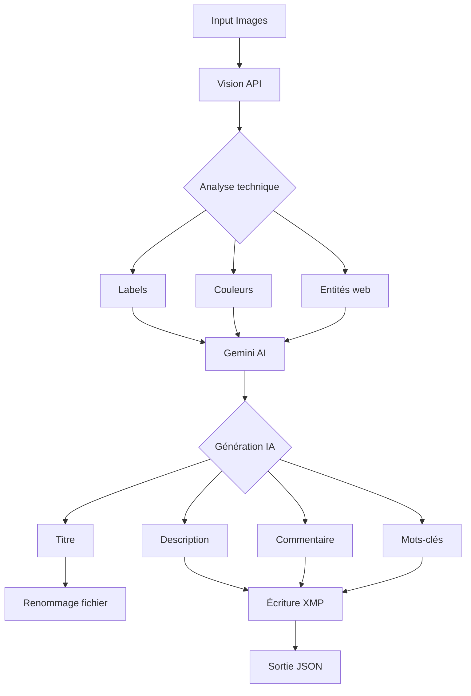

```markdown
# Image Metadata Auto-Tagger 🖼️🤖

Outil Python pour l'analyse d'images et la génération automatique de métadonnées enrichies (IPTC/XMP) utilisant Google Vision API et Gemini AI.


## ✨ Fonctionnalités

- **Analyse par lots** de répertoires d'images (JPG/PNG)
- **Génération intelligente** via IA :
  - 📌 Titres optimisés SEO
  - 📝 Descriptions contextuelles
  - 🎨 Interprétations artistiques
  - 🔑 Mots-clés thématiques
- **Écriture des métadonnées** :
  - ✅ Normes IPTC/XMP
  - 🌍 Support multilingue
  - 🖼️ Compatibilité Adobe/Lightroom
- **Automatisations** :
  - 🔄 Renommage intelligent des fichiers
  - 📊 Statistiques de traitement
  - 💾 Export JSON structuré

## 🚀 Installation

**Prérequis** :
- Python 3.10+
- Compte Google Cloud avec :
  - Vision API activé
  - Generative Language API activé

```bash
git clone https://github.com/votre-repo/img-auto-tagger.git
cd img-auto-tagger
pip install -r requirements.txt
```

## ⚙️ Configuration

1. **Credentials Google Cloud** :
   - Créez un compte de service dans [Google Cloud Console](https://console.cloud.google.com/)
   - Téléchargez le fichier JSON des identifiants
   - Placez-le dans `config/service-account.json`

2. **Variables d'environnement** (optionnel) :
```bash
export GOOGLE_APPLICATION_CREDENTIALS="config/service-account.json"
```

## 🖥️ Utilisation

**Commande de base** :
```bash
python -m src.main <input_path> --credentials <credentials_path> [options]
```

**Options complètes** :
| Option         | Description                                | Valeur par défaut |
|----------------|--------------------------------------------|-------------------|
| `--output`     | Fichier de sortie JSON                     | results.json      |
| `--lang`       | Langue de sortie (fr/en)                   | fr                |
| `--project`    | ID projet GCP (auto-détecté si omis)       | Auto              |

**Exemples** :
```bash
# Traitement d'un répertoire
python -m src.main ./photos --credentials config/service-account.json --lang en --output analysis.json

# Traitement d'une image unique
python -m src.main image.jpg --credentials config/key.json
```

## 📂 Structure des sorties

**Fichier JSON** :
```json
{
  "original_file": "photo.jpg",
  "new_file": "Paysage_estival.jpg",
  "path": "/output/Paysage_estival.jpg",
  "title": "Paysage estival",
  "description": "Vaste panorama montrant...",
  "comment": "Cette œuvre évoque...",
  "main_genre": "Photographie",
  "secondary_genre": "Nature",
  "keywords": ["été", "montagne", "ciel"],
  "metadata_written": true,
  "processing_time": 4.12
}
```

**Métadonnées images** :
| Champ               | XMP                     | IPTC                  |
|---------------------|-------------------------|-----------------------|
| Titre               | dc:title                | ObjectName            |
| Description         | dc:description          | Caption               |
| Commentaire         | exif:UserComment        | SpecialInstructions   |
| Mots-clés           | dc:subject              | Keywords              |
| Catégorie principale| Iptc4xmpCore:Category   | Category              |
| Sous-catégorie      | Iptc4xmpCore:SupplementalCategories | SuppCategory |

## 🖼️ Formats supportés

| Format | Métadonnées         | Renommage | Remarques               |
|--------|---------------------|-----------|-------------------------|
| JPG    | IPTC + XMP          | ✓         | Support complet         |
| PNG    | XMP                 | ✓         | Pas de IPTC natif       |
| HEIC   | ❌                  | ❌        | Non supporté actuellement |

## 🧠 Architecture technique



## 🔧 Dépannage

**Problèmes courants** :
1. **Erreurs d'encodage** :
   ```bash
   export PYTHONUTF8=1
   ```
2. **Permissions API** :
   - Vérifier que les APIs sont activées
   - Vérifier les quotas Google Cloud

3. **Métadonnées non sauvegardées** :
   ```bash
   exiftool -xmp:all -iptc:all image.jpg
   ```

4. **Erreurs Gemini** :
   - Activer le logging détaillé :
   ```python
   logging.basicConfig(level=logging.DEBUG)
   ```

## 🤝 Contribution

1. Fork du projet
2. Créez une branche (`git checkout -b feature/amelioration`)
3. Commitez vos changements
4. Poussez la branche (`git push origin feature/amelioration`)
5. Ouvrez une Pull Request

## 📜 Licence

MIT License - Voir le fichier [LICENSE](LICENSE) pour détails

---

**Optimisé pour** :  


```

Ce README inclut tous les éléments essentiels pour une utilisation professionnelle du projet, avec des badges dynamiques, une documentation technique détaillée et des guides de dépannage. Adaptez les liens et les sections spécifiques selon votre implémentation réelle.